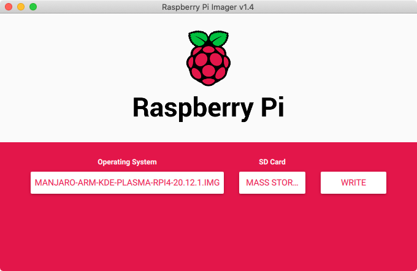
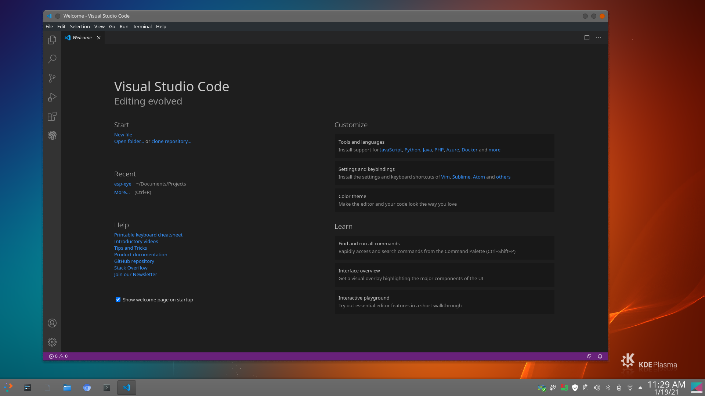

# How to install Manjaro ARM64 Linux and Visual Studio Code on a Raspberry Pi

In the last few weeks I have been experimenting with different Linux distributions on my Raspberry Pi 4B, wanting to use the Pi as a Desktop for software development using Microsoft Visual Studio Code.

After trying the original 32 bit Raspbian and 32 and 64 bit flavors of Ubuntu I am settling for Manjaro Arch Linux for now. This tutorial will walk you through how to setup Manjaro ARM64 and get setup with Visual Studio Code.

First you will have to [download](https://manjaro.org/download/#raspberry-pi-4) the "latest" version of Manjaro for Raspberry Pi from the [Manjaro website](https://manjaro.org/download/#raspberry-pi-4). I tried out both the KDE Plasma and the XFCE version. Not sure I have a favorite yet.

Once you have downloaded the file extract the img file from the archive and flash it to an SD Card. I used the [Raspberry Pi Imager](https://www.raspberrypi.org/software/) app on my Macbook but I am sure it will work with something like [Balena Etcher](https://www.balena.io/etcher/) too.



Once that completed just pop the SD Card into a Raspberry Pi 4 and turn it on. The installer will ask you some basic questions, the keyboard you are using, your username, groups and full name, the passwords you would like to set to set for your user account and the root account, your timezone and local and the hostname for you Pi before finishing up the installation, pretty straightforward.

Once you enter that data the installer will run and do things like resize the partition to use the full size of the SD card and finish up the installation. This can take a while so sit back and relax.

Once that finishes you can connect to your Wifi network by clicking on the network icon in the toolbar and setting the correct info or if you had hardwired your Pi you are already set to go!

Manjaro uses a package manager called pacman to update and install software and after the linux installation finishes we are going to need some to run some updates:

```
sudo pacman -Syu
```

And install some required software for my development needs:

```
sudo pacman -S git
sudo pacman -S base-devel
cd ~/Downloads
git clone https://AUR.archlinux.org/visual-studio-code-bin.git
cd visual-studio-code-bin/
makepkg -s
sudo pacman -U visual-studio-code-bin-1.52.1-1-aarch64.pkg.tar.zst
```

And you are done, you have a version of Manjaro running with Visual Studio Code installed, how easy was that?


